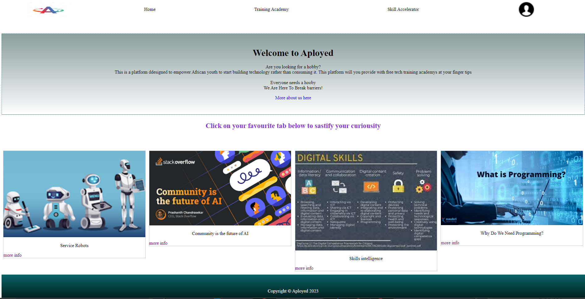
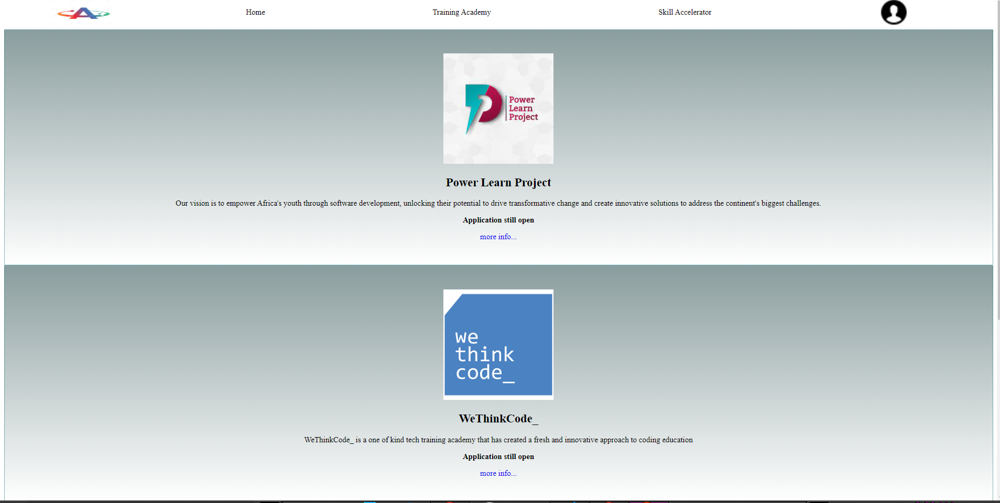
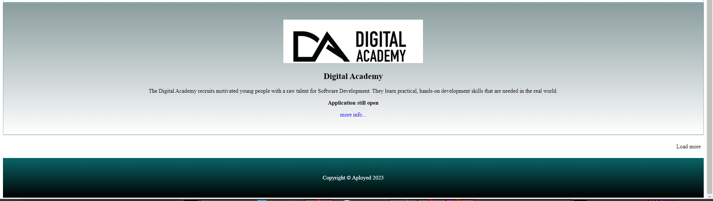

# Aployed

Apployed is a web application platform that is designed to be aplatform that empoer African youth to start building their own

It will minimise drug abuse and cirminal offense from the African youth and equip them with tech skills to give them an oportunity get and to create jobs.

By that South African unemployeed rate drops
Everyone needs a hobby

Everyone needs a hooby
We Are Here To Break barriers!

## Preview

 

 

## Problem Statement

In a population of approximately 60.6 million people in South Africa, 32.6% is the rate of youth umeployement.

## Mission statement

## Technical requirements

- Language: Python
- Framework: Django
- Coding environment: virtual environment
- Design: HTML
- Style: CSS

## How to run the project

- Given django is installed
- Given virtual environment is activated
- On your terminal project directory type:
  `python manage.py runserver`
- On your browser type: `https://localhost:5000`

### Breaking barriers

GIF here
