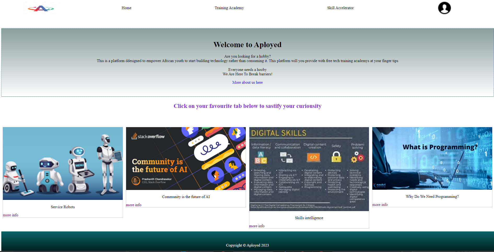

# Aployed

Apployed is a web application platform that is designed to be aplatform that empoer African youth to start building their own

It will minimise drug abuse and cirminal offense from the African youth and equip them with tech skills to give them an oportunity get and to create jobs.

By that South African unemployeed rate drops
Everyone needs a hobby

Everyone needs a hooby
We Are Here To Break barriers!

## Preview

 

 

## Problem Statement

In a population of approximately 60.6 million people in South Africa, 32.6% is the rate of youth umeployement.

## Mission statement

## Technical requirements

-   Language: PHP
-   Framework: Laravel
-   Package manager: Composer
-   Project manager: PHP artisan
-   Mark-Up: HTML
-   Style: CSS
-   Templating: Blade

## How to run the project

-   Clone repo
-   Insure you have PHP and composer installed
-   Run composer update
-   Rename file in base directory from prototypeEnv to .env
-   Create an sql database with the name aployed
-   import the provided .sql to avoid running make migrations commands
-   To start server run `php artisan serve`
-   In your browser type: `https://localhost:8000`

### Breaking barriers

GIF here
